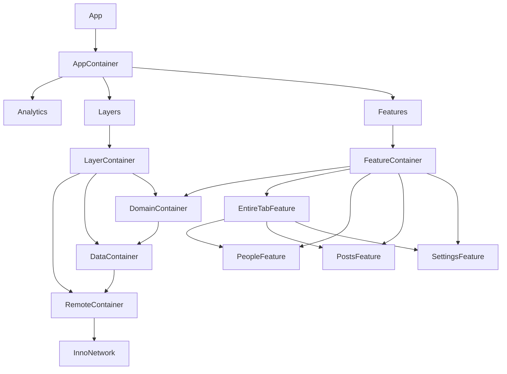

# InnoSample

`InnoSample`은 `banksalad-ios`의 `Features / Layers / ThirdParties / Util` 분리를 참고해 만든 Tuist 기반 baseline sample 입니다.
목적은 기능 구현보다 먼저, Inno 계열 앱에서 공통으로 쓸 **모듈 경계, composition 방식, DI wiring, navigation ownership, Tuist helper 정책**을 고정하는 데 있습니다.  
즉 이 저장소는 “샘플 앱”이면서 동시에 **개발 시작 전 기본 뼈대(scaffold)** 역할을 합니다.

구조 원칙은 다음 의존 방향으로 정리합니다.
- `Feature -> Domain`
- `Data -> Domain`
- `Remote -> Data + InnoNetwork`
- `Layers -> Domain + Data + Remote`
- `Features -> Domain + Feature`
- `App -> Layers + Features + ThirdParty`

`InnoDI`, `InnoFlow`, `InnoNetwork`, `InnoRouter`를 쓰는 각 모듈은 독립 `Project.swift`로 관리하고, 루트는 `Workspace.swift`로 조립합니다.  
Inno 라이브러리 의존성은 로컬 path package가 아니라 각 프로젝트 manifest의 remote package 고정 방식으로 소비합니다. 현재 기준 pin은 InnoDI 6.0 공개 계약 후보 revision `f1a3eaccf19bfc43164de3621c9197c731d92342`, `InnoFlow 5.1.0`, `InnoNetwork 5.0.0`, `InnoRouter 5.2.1`입니다.

기본 개발 환경은 `Xcode 26.4+` 또는 `Xcode 27.x`, Swift language mode `6.3`, `.mise.toml`에 고정한 `Tuist 4.202.5`입니다. InnoNetwork 5.0의 default `Macros` package trait를 Tuist XcodeProj에서 보존하려면 이 버전이 필요합니다.

상세 구조 평가와 개선 우선순위는 [Docs/ArchitectureReview.md](Docs/ArchitectureReview.md) 에 정리합니다.

## Architecture Intent

이 샘플은 `banksalad-ios/Layers`의 루트 composition 아이디어를 `InnoDI` 방식으로 축소 적용한 baseline scaffold 입니다.

핵심 의도는 세 가지입니다.
- 개발을 시작하기 전에 레이어 경계와 책임을 먼저 고정한다.
- root composition과 feature composition을 분리해서 상위 wiring 비용을 낮춘다.
- 샘플 코드가 아니라 실제 앱 시작점으로 이어질 수 있는 구조를 제공한다.

- `InnoNetwork`
  - 가장 안쪽 transport 구현입니다.
  - `NetworkClient`, `APIDefinition`, retry, interceptor, logger 같은 실행 메커니즘을 가집니다.
- `Remote`
  - 외부 API의 endpoint 의미, remote model decode, InnoNetwork client 조립을 소유합니다.
  - `Data`가 소유한 remote data source contract를 구현합니다.
  - base URL, retry, timeout, request/response interceptor, auth refresh, response cache, remote failure 변환을 이 레이어 안에 둡니다.
- `Data`
  - domain repository 구현과 remote data source contract를 함께 소유합니다.
  - 비어 있는 응답 처리나 리스트 curate 같은 데이터 정책이 이 레이어에 있습니다.
- `Domain`
  - entity, repository contract, use case implementation만 가집니다.
  - 네트워크 구현이나 remote model을 모릅니다.
  - repository는 레이어 경계 계약이라 protocol을 유지합니다.
  - use case는 현재 stateless 단일 구현체라 protocol을 유지할 실익이 작아서 concrete type으로 제공합니다.
  - 즉 use case는 feature에 주입되는 의존성이지만, domain에서는 shared scope로 보관하지 않고 shared repository 위에 매번 가볍게 조합되는 concrete stateless 값으로 다룹니다.
  - concrete use case의 public surface는 `callAsFunction()` 하나로 제한하고, 생성 책임은 `Domain` 내부에만 둡니다.
- `Layers`
  - `Remote -> Data -> Domain`을 연결하는 composition-only 모듈입니다.
  - `RemoteContainer`, `DataContainer`, `DomainContainer`를 순서대로 생성하고, feature가 바로 받는 use case만 외부에 노출합니다.
  - business logic, remote model, use case 구현을 두지 않습니다.
- `Features`
  - leaf feature router들을 묶는 root feature composition 모듈입니다.
  - `App`이 전달한 use case로 각 leaf feature input을 만들고, root `FeatureContainer`가 leaf `Router` 타깃만 조립합니다.
  - `App`은 개별 feature wiring 대신 root `FeatureContainer`만 연결합니다.
  - leaf feature는 `Interface / Logic / UI / Router / Testing / Tests` 타깃으로 나눠서 컴파일 단계에서 구조를 강제합니다.
  - cross-feature navigation도 leaf끼리 직접 연결하지 않고, `EntireTab` 같은 상위 coordinator가 child coordinator를 중재하는 방식으로만 처리합니다.

이 선택은 DI를 제거한 것이 아닙니다.

- repository는 `Data -> Domain` 경계를 넘는 진짜 계약이라 protocol을 유지합니다.
- use case는 지금 기준으로 구현이 하나뿐인 stateless wrapper라, protocol 추상화보다 concrete type이 더 읽기 쉽습니다.
- 따라서 `Feature`에는 use case를 의존성으로 주입하되, `Domain`에서는 concrete type을 computed value로 제공합니다.
- 그리고 feature가 보는 public interface는 `callAsFunction()` 하나뿐이라, use case를 단일 action object처럼 다룰 수 있습니다.
- 추후 use case 구현이 둘 이상 생기거나 decorator/cache/logging wrapper가 붙으면 protocol 재도입을 다시 검토할 수 있습니다.

컨테이너 경계는 아래처럼 나뉩니다.

- `AppContainer`
  - 전역 인프라와 상위 composition 연결만 담당
- `LayerContainer`
  - `RemoteContainer -> DataContainer -> DomainContainer` 조립을 담당하고 feature가 바로 쓸 use case만 외부에 노출
- `FeatureContainer`
  - root `Features` 프로젝트에서 leaf `Router` 타깃만 조립
  - `LayerContainer` 자체를 모르고 concrete use case만 입력으로 받음
  - 외부에는 root coordinator만 공개하고, child router/input/use case는 내부 구현으로 유지
- 각 leaf feature
  - `Interface`
    - 외부에 공개할 feature entry/input/output 계약만 둠
  - `Logic`
    - `InnoFlow` reducer/state/action/effect와 use case 호출만 담당
    - `SwiftUI`, `InnoRouter` import 금지
  - `UI`
    - SwiftUI scene/view와 `Util` 기반 공용 UI 조합만 담당
    - `Domain`, `InnoRouter` 직접 import 금지
  - `Router`
    - `InnoRouter` coordinator, push/modal/tab wiring 담당
    - root `Features`가 조립하는 concrete 진입점
  - `Testing`
    - fixture와 test helper 제공

`InnoRouter`는 상위 coordinator가 child coordinator를 조립하는 구조와 잘 맞지만, sibling navigation을 자동으로 해결해 주지는 않습니다.  
이 샘플에서는 `People -> Settings -> People` 왕복 이동 예제를 넣되, leaf feature는 sibling router를 직접 모르고 intent만 올리며 `EntireTabCoordinator`가 실제 탭 전환과 child detail push를 중재합니다.

- `People UI -> People Logic intent -> People Coordinator consume -> EntireTabCoordinator mediation -> SettingsCoordinator push`
- `Settings UI -> Settings Logic intent -> Settings Coordinator consume -> EntireTabCoordinator mediation -> PeopleCoordinator push`

즉 런타임 이동은 왕복이 가능하지만, 컴파일 의존은 `People -> EntireTab <- Settings` 구조만 유지합니다.

이렇게 둔 이유는 두 가지입니다.

- `AppContainer`가 remote/data/domain 구현이나 개별 feature wiring을 직접 조립하지 않게 해서 상위 composition 책임을 줄이기 위해
- `banksalad-ios`와 비슷하게 루트 `Layers` 프로젝트가 `Remote/Data/Domain` 연결을 맡고, 루트 `Features` 프로젝트는 domain 의존성만 받아 feature 조립을 맡게 하기 위해

즉, 이 샘플에서 `Remote`는 외부 API 호출 정책을 소유하고, `Layers` 루트 프로젝트와 `Features` 루트 프로젝트는 구현 레이어가 아니라 composition 레이어입니다.

## Architecture Graph



이 그래프는 현재 샘플의 실제 composition 의도를 문서용으로 수동 관리합니다.  
`InnoDI-DependencyGraph`는 시각화보다 DAG 검증용으로 사용합니다.

## Manifest Structure

- `Workspace.swift`
  - 전체 모듈 project를 묶는 루트 workspace
- `Tuist/ProjectDescriptionHelpers`
  - 공용 destinations / deployment targets / dependency helper
- `App/Project.swift`
- `Features/Project.swift`
- `Layers/*/Project.swift`
- `Features/*/Project.swift`
- `ThirdParties/*/Project.swift` (SDK wrapper가 생길 때 사용)
- `Utils/*/Project.swift`

Tuist helper는 현재 두 단계로 destinations / deployment targets를 나눕니다.
- 일반 모듈: `defaultDestinations` / `defaultDeploymentTargets` (`iPhone / iPad / macOS`)
- shared multi-platform 모듈: `sharedModuleDestinations` / `sharedModuleDeploymentTargets` (`iPhone / iPad / macOS / tvOS / visionOS / watchOS`)
실제 iOS 앱과 함께 설치되는 watchOS companion은 modern single-target SwiftUI watchOS app으로 두며, 현재 샘플은 `App` 프로젝트 안에 `InnoSampleWatchApp` 타깃을 포함합니다.

## Module Map

### App
- `App/Sources/InnoSampleApp.swift`
  - Composition root
  - `AppContainer`에서 InnoDI graph를 만들고 root `Features` scene에 전달
  - 샘플 analytics wrapper를 통해 앱 시작 이벤트를 기록
- `App/Sources/AppContainer.swift`
  - `InnoDI` root container
  - base URL 입력으로 `LayerContainer -> FeatureContainer` 순서로 조립
  - `Layers` 내부의 data/domain container를 모르고, 개별 feature wiring 대신 use case를 root `Features`에 전달
  - `AnalyticsClient` concrete 구현을 앱 composition root에서 생성
  - `Project.app(watchCompanion: ...)`로 iOS companion용 single-target SwiftUI watchOS app을 함께 생성
  - `App/Project.swift`에서 앱 타깃 정의

### Layers
- `Layers`
  - composition-only framework
  - `LayerContainer`는 plain composition wrapper로 남기고, `RemoteContainer -> DataContainer -> DomainContainer`를 연결한 뒤 feature 입력용 use case만 외부에 노출
  - `App`과 root `Features`는 내부 조립 단계를 모르고 `LayerContainer.featureUseCases` 같은 feature-facing surface만 사용
  - `SwiftUI`, `InnoFlow`, `InnoRouter`, `InnoNetwork`를 import 하지 않음
  - 현재 제약:
    - `FeatureContainer`, `AppContainer` 같은 UI/root composition만 `@MainActor`
    - `LayerContainer`는 non-UI composition이므로 actor-agnostic 유지
    - `Domain`, `Data`, `Remote`의 shared contract는 actor-agnostic 유지
    - `Features`는 `DomainContainer` concrete를 직접 알지 않고 `FeatureUseCaseContaining`만 소비
    - `App`은 `RemoteContainer`, `DataContainer`, `DomainContainer`를 직접 조립하지 않음
- `Layers/Domain`
  - summary 모델은 도메인별 `Models`에 두고, `DomainContainer`와 도메인별 composition extension은 `Container` 아래로 분리
  - repository protocol과 concrete use case 정의
  - shared contract는 actor-agnostic로 유지하고, main actor는 `Layers / Features / App` composition 경계에서만 적용
  - `DomainContainer`가 모든 repository 입력을 받고, use case는 도메인별 extension에서 computed로 제공
  - 현재 제약:
    - `Domain`은 `Data` contract만 알고 `Remote`를 모름
    - summary 모델, repository protocol, use case는 도메인별 폴더에 두고, composition helper는 `Container` 아래로 분리
- `Layers/Data`
  - repository 구현과 remote data source contract 정의
  - `DataContainer`가 모든 repository를 shared로 제공
  - `User/Post/Todo` 도메인 아래 `Models/DataSources/Repositories/Factories`로 폴더를 나눠 책임을 드러냄
  - 현재 제약:
    - `Data`가 DTO -> Domain 매핑과 curate / empty response 정책을 담당
    - `Data`는 `RemoteDataSourceContaining` contract만 의존하고 `RemoteContainer` concrete는 직접 퍼뜨리지 않음
- `Layers/Remote`
  - JSONPlaceholder request definition, remote model decode, InnoNetwork client 조립
  - `User/Post/Todo` 도메인 아래 `Requests/DataSources/Factories`로 폴더를 나누고, 공통 실행 정책은 `Infrastructure`에 둠
  - raw 응답을 그대로 퍼뜨리지 않고, 필요한 필드만 평탄화/정규화한 DTO를 반환
  - `Data`가 정의한 remote data source contract 구현
  - `RemoteContainer`가 base URL로 InnoNetwork client와 data source를 shared로 제공
  - `InnoNetwork 5.0.0`의 default `Macros` trait에서 제공하는 `@APIDefinition(method:path:auth:)`로 모든 named endpoint의 method/path/auth와 protocol witness를 생성
  - `FetchTodosRequest`는 `auth: .required`로 인증 경계를 명시하고, `RefreshTokenPolicy(appliesTo:)`로 `/todos`에만 bearer token refresh/replay를 적용
  - app 조립 경로는 `InnoNetworkPersistentCache`와 `CachePack(responseCachePolicy: .rfc9111Compliant(wrapping: .cacheFirst(maxAge: .seconds(300))))`로 GET 응답 cache를 opt-in 구성
  - persistent cache 저장 위치는 user caches 하위 `InnoSample/RemoteHTTPCache`, 한도는 25 MiB / 500 entries
  - request는 InnoNetwork 기본 헤더를 보존하고, `X-Sample-Feature`와 `User-Agent`처럼 cache key가 안정적인 메타데이터만 적용
  - 요청마다 달라지는 request-id/trace header는 public GET cache reuse를 깨지 않도록 넣지 않음
  - 각 layer는 별도 `Project.swift`로 분리
  - 현재 제약:
    - `Remote`는 DTO decode와 remote data source 구현만 담당하고 `Domain` 모델을 직접 만들지 않음
    - request 실행, request metadata, remote failure 변환은 `Remote` 내부 구현으로 유지

### Features
- `Features`
  - root feature composition framework
  - `FeatureContainer`와 `FeatureRootScene`를 제공
  - `App`이 전달한 use case로 leaf feature `Router` 타깃과 tab container를 조립
  - 외부 공개 표면은 root coordinator 중심으로 유지
  - generated 파일과 test support를 제외한 production 코드는 가급적 한 파일에 한 top-level 객체만 두고, 같은 씬 안에서만 쓰는 보조 뷰는 `Screen+*.swift` extension 파일로 분리
  - UI 규칙:
    - 메인 화면과 push destination은 `*Screen`, modal은 `*Sheet` suffix 사용
    - 한 씬 안에서만 쓰는 보조 뷰와 section builder는 `Screen+*.swift` extension 파일로 분리
    - 재사용 가능한 공용 컴포넌트만 `SampleDesignSupport`로 승격
  - Router 규칙:
    - coordinator와 route 정의는 `Router`에 두고, navigation/modal host view는 `*RouteHost` suffix 사용
    - route enum은 `@Router`가 destination과 store를 생성하고, view는 `@EnvironmentRouter`로 navigation command를 전송
    - People/Settings는 `RouterHost`, list-detail split-view가 핵심인 Posts는 `RouterSplitHost`를 사용하며 watchOS에서는 `RouterHost`로 축소
    - tab shell은 `@Router` + `@TabItem` + `RouterTabHost`, deep link는 scheme/host allowlist를 가진 `@Router` + `@DeepLink`의 generated resolver를 사용
    - coordinator는 business intent와 sibling mediation만 소유하고 navigation store를 수동 보관하지 않음
- `Features/EntireTabFeature`
  - 3탭 셸 (`People`, `Posts`, `Settings`)
  - `SampleTab`의 `@Router` + `@TabItem` 선언과 `RouterTabHost` 사용
  - `SampleDeepLink`의 `@DeepLink` 선언과 generated `resolveDeepLink(_:)` 사용
  - `EntireTabFeatureInterface / Logic / UI / Router / Testing / Tests`로 분리
  - `EntireTabContainer`는 `Router` 타깃에서 탭 coordinator를 조립
- `Features/PeopleFeature`
  - `/users` 호출
  - row 선택 시 push detail
  - `Overview` 버튼으로 modal sheet
  - `PeopleFeatureInterface / Logic / UI / Router / Testing / Tests`로 분리
  - `PeopleFeatureContainer`는 `Router` 타깃에서 coordinator를 조립
- `Features/PostsFeature`
  - `/posts` 호출
  - row 선택 시 push detail
  - `Highlights` 버튼으로 modal sheet
  - `PostsFeatureInterface / Logic / UI / Router / Testing / Tests`로 분리
  - `PostsFeatureContainer`는 `Router` 타깃에서 coordinator를 조립
- `Features/SettingsFeature`
  - `/todos` 호출
  - row 선택 시 push detail
  - `Digest` 버튼으로 modal sheet
  - `SettingsFeatureInterface / Logic / UI / Router / Testing / Tests`로 분리
  - `SettingsFeatureContainer`는 `Router` 타깃에서 coordinator를 조립
  - 각 feature는 별도 `Project.swift`에서 다중 타깃으로 분리

### ThirdParties
- `ThirdParties/Analytics`
  - 외부 SDK wrapper 예시 모듈
  - `AnalyticsInterface` framework에 상위 모듈이 의존할 계약을 둡니다.
  - `Analytics` static library에 가상의 SDK adapter 구현을 둡니다.
  - `App`이 composition root로서 concrete 구현을 생성하고 앱 시작 이벤트를 기록합니다.
- `Project.thirdParty(...)`
  - `Interface` framework + implementation static library + tests 조합을 기본으로 제공
  - `ThirdParty`는 SDK wrapper/provider adapter 전용이라는 전제를 반영합니다.

### Utils
- `Utils/SampleDesignSupport`
  - 로딩/에러/metric card/pill 같은 공용 UI 컴포넌트
  - 샘플 내부 helper/UI support 모듈이므로 `ThirdParty`가 아니라 `Util`로 분리합니다.
  - 독립 framework project

## Run

```bash
tuist install
tuist generate --no-open
open InnoSample.xcworkspace
```

or

```bash
make install-dependencies
make generate
make open
```

## Verify

CI와 동일한 최소 gate:

```bash
make verify-ci
```

`make verify-ci`는 `tuist install`, `tuist generate --no-open`, layer boundary check, InnoDI graph validation, Remote tests, leaf/root feature tests, iOS app build를 실행합니다. GitHub Actions의 `.github/workflows/verify.yml`도 같은 target을 사용합니다.

로컬에서 더 넓게 확인하려면 아래를 사용합니다.

```bash
make verify
```

## UI Test Scope

- `App/UITests`는 app 레벨 smoke test와 핵심 사용자 흐름 검증만 담당합니다.
- 현재 baseline 시나리오:
  - 앱 실행
  - 3개 탭 전환
  - People / Posts / Settings 리스트 렌더링 확인
  - People detail push
  - People overview modal 표시/닫기
- feature별 UI test 타깃은 두지 않고, 루트 시나리오 중심으로 유지합니다.

## Docs

- [ArchitectureReview](Docs/ArchitectureReview.md)
- [LinkagePolicy](Docs/LinkagePolicy.md)

## Build Notes

- `Layers`는 현재 framework로 유지합니다.
- generated artifact hygiene는 `.gitignore` 기준으로 유지합니다.
  - `.build/`
  - `Derived/`
  - `.xcodeproj/`
  - `.xcworkspace/`
  - `xcuserdata/`
  - `.xcuserstate`
  - `.DS_Store`
- 이유는 `App`과 root `Features`가 모두 `Layers`를 소비하는 구조라, static product로 두면 duplicate link 경고가 발생하기 때문입니다.
- 추후 `App`이 `Layers`를 직접 참조하지 않는 구조로 바뀌면 static product 복귀를 다시 검토할 수 있습니다.

## Workspace Hygiene

- `Derived/`, `xcuserdata/`, `.DS_Store`, `.xcuserstate`는 repo 관리 대상이 아닙니다.
- root, Tuist, generated workspace의 `Package.resolved`는 repo 관리 대상이 아닙니다.
- `.gitignore`에서 이 산출물을 무시하고, boundary script와 wiring test로 실제 구조 회귀를 검증합니다.

## Dependency Strategy

- `InnoSample`은 로컬 monorepo path dependency 샘플이 아니라, 릴리즈된 Inno 라이브러리를 소비하는 샘플입니다.
- Inno 라이브러리 의존성 source of truth는 `Tuist/ProjectDescriptionHelpers/Dependency/TargetDependency+.swift`의 remote package requirement와 각 `Project.swift`의 package 목록입니다.
- `Tuist/Package.swift`는 per-project package 해석과 중복되지 않도록 dependency 목록을 비워 둡니다.
- `Package.resolved`는 SwiftPM/Tuist가 생성하는 산출물로만 취급합니다. fresh generate가 선언된 remote requirement를 다시 해석하므로 lockfile을 저장소에 고정하지 않습니다.
- 따라서 프레임워크를 로컬 수정해 즉시 반영하는 용도보다는, 외부 사용자 관점의 통합 예제로 보는 편이 맞습니다.
- 공개 배포된 macro surface가 있으면 우선 사용합니다. 단, InnoDI 6.0 assisted-factory 검증은 배포 전 revision을 고정한 명시적 파일럿입니다. `InnoNetwork 5.0.0`은 root product의 default `Macros` trait로 `@APIDefinition`을 제공하므로 별도 codegen package 없이 사용합니다.

현재 의존성 표면:

| Package | Version | Sample surface |
| --- | --- | --- |
| `InnoDI` | `6.0 candidate @ f1a3eac` | 공개 `@Input(.assisted)`·`@AssistedFactory`·`DIContainerHost`, Xcode/Tuist DAG validation plugin |
| `InnoFlow` | `5.1.0` | `@InnoFlow(phaseManaged: true)`, `PhaseMap`, `EffectTask.cancellable`, `@BindableField`, `StoreInstrumentation`, `TestStore`, `ManualTestClock` |
| `InnoNetwork` | `5.0.0` | `@APIDefinition(method:path:auth:)`, `NetworkClient.request(_:)`, `RefreshTokenPolicy(appliesTo:)`, `AuthPack`, `CachePack`, `InnoNetworkPersistentCache`, `MockURLSession`, `StubNetworkClient` |
| `InnoRouter` | `5.2.1` | `@Router`, `@TabItem`, `@DeepLink`, `RouterHost`, `RouterSplitHost`, `RouterTabHost`, `@EnvironmentRouter`, `FlowTestStore` |

현재 확인된 검증 상태:
- fresh `tuist generate --no-open`: 통과
- generated workspace resolution: InnoDI revision `f1a3eaccf19bfc43164de3621c9197c731d92342` 및 나머지 exact version과 일치
- Remote 16개 + feature 25개, 총 41개 테스트와 generic iOS app/embedded watch app build: 통과
- 전체 `make verify-ci`: 통과 (2026-09-05, Xcode 27.0, Tuist 4.202.5)
